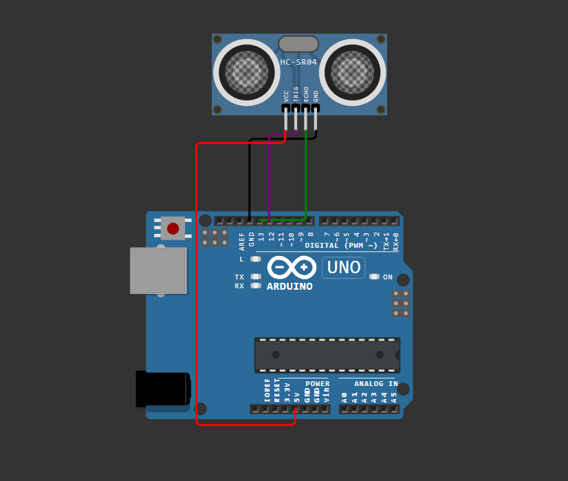

# Reading distance with HC-SR04



## Project Description

This project implements the reading of the distance of objects in relation to the HC-SR04 ultrasonic sensor using the Ultrasonic library on the Arduino Uno.

## Components

- ( 1 ) Arduino Uno
- ( 1 ) HC-SR04

> Project Status: concluded

### Git

To manage version control and clone repositories, you'll need Git. Here's a quick installation guide:

1. **Download**: Visit the [Git website](https://git-scm.com/) and download the appropriate installer for your operating system.
2. **Install**: Run the installer and follow the setup instructions. You can choose the default options for most settings.
3. **Verify**: Open a terminal or command prompt and type `git --version` to ensure Git is installed correctly.

## Cloning the Repository

To clone this repository to your local machine, follow these steps:

1. **Open Terminal**: Open a terminal or command prompt on your machine.
2. **Clone Repository**: Use the following command to clone the repository:

   ```bash
   git clone https://github.com/HenriqueMelo2007/reading-hc-sr04.git
   
## Contacts

📧 henriquemelo0983@gmail.com

💼 LinkedIn: [Henrique Melo](https://www.linkedin.com/in/henrique-de-oliveira-melo-933a41203/)